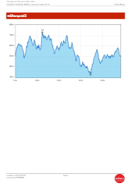

= Stoakraftweg

== Mindest Gepäck Liste

* Gute Schuhe
* Rucksack
* Essen das leicht im Magen liegt
* Wasser (bei uns am weg werden die Wasserstellen vermutlich noch nicht eingeschaltet sein, d.h ganz viel wasser)
* Warme Kleidung(Handschuhe, Jacke, Haube,...)
* Gehstock

== Höhenprofil
[.stretch]

== Motivationsworte

Und letzte Sache der weg sind 48km, des is extrem viel und darf definitiv ned unterschätzt werden wir habns letztes Jahr schon gemerkt wie kräfte zerrend des sein kann. Auch wenn ma aufs Höhen Profil schaut, ist des vielleicht für die meisten ned so Aussage kräftig aber i sags mal so ma darf halt nie vergessen das ma im Mühlviertel sind und des sicher extrem anstrengend wird. Also grade an die de letztes Jahr ned dabei waren, tendenziell wird’s um einiges schlimmer wies euch de vorstellts und nehmts wirklich gescheites Gewand und somit, weil es wird sicher kein leichter Spaziergang
